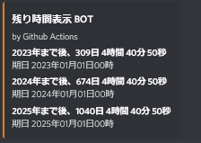

# discord timer bot by github actions

---
## 目次
---

* [基本設定](#基本設定)
* [実行](#実行)
* [Reference](#reference)
* [Tips](#tips)
* [ディレクトリ](#ディレクトリ)

---
## 基本設定
---
1. GitHub で本リポジトリを `Fork` する
1. `Fork` したリポジトリの `Settings` をクリック
1. `Secrets > Actions` をクリック
1. `DISCORD_WEBHOOK` と `DEADLINE`を設定する
    1. `New repository secret` をクリック
    1. `Name` に `DISCORD_WEBHOOK` を入力
    1. `Value` に通知を送りたいチャンネルのdiscordのWEBHOOKを入力 ([Qiita, @Takkun053, [Python]DiscordのWebhookで遊ぶ。](https://qiita.com/Takkun053/items/88e2d86838f711fda7e5))
    1. `Add secret` をクリック
    2. 再度、 `New repository secret` をクリック
    3. `Name` に `DEADLINE` を入力
    4. `Value` に期日を入力 
        - 下記のフォーマット (半角スペース)

    ~~~
    2023年 2023 01 01 00
    2024年 2024 01 01 00
    2025年 2025 01 01 00
    ~~~
    1. `Add secret` をクリック

---
## 実行
---
1. `Actions` をクリック
1. `discord_bot_timer` をクリック
1. `Run workflow` をクリック
- cronで朝7時に実行される

 

---
## Reference
---
- [github, k5-mot, auto-hms-action, https://github.com/k5-mot/auto-hms-action](https://github.com/k5-mot/auto-hms-action)

---
## Tips
---
- [cod-log [discord.py] Discord botユーザを作成し、トークンを取得する手順](https://cod-sushi.com/discord-py-token/)
- [qita, 初心者に捧ぐDiscordのEmbed入門, @hisuie08](https://qiita.com/hisuie08/items/5b63924156080694fc81)
- [discord-webhook](https://pypi.org/project/discord-webhook/)
---
##  ディレクトリ
---

|Name|Explanation|
|:-------------|:---|
|[main.py](./main.py) |python code|
|[python-app.yml](./.github/workflows/python-app.yml)|yaml file|
